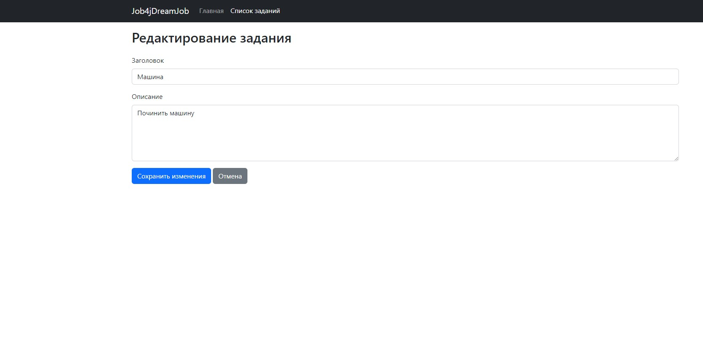

Проект "TODO список" по курсу Java Middle от job4j.ru
Приложение для создания заметок, и их редактирования.

Реалзиованый функционал:
-Отображение списка заметок
-Возможность редактировать
-Удалять
-Переводить в статус "Выполнено"

Стек технологий: Spring boot, Thymeleaf, Bootstrap, Hibernate, PostgreSql

Требования к окружению: Java 17, Maven 3.8 и выше, PostgreSQL начиная с 16 версии.

Запуск проекта:

1. create database todo;
2. указать конфигурацию в src/main/resources/application.properties
3. запустить src/main/java/ru/job4j/cinema/Job4jTodoApplication.java

Выполнил Кучеров Филипп  https://github.com/grave42